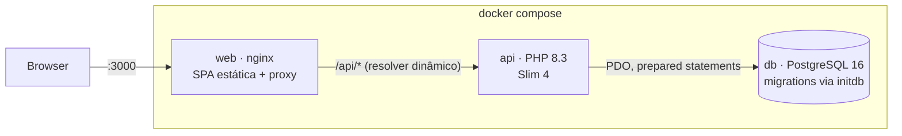
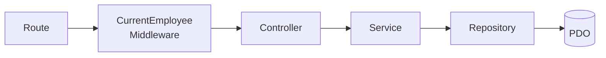
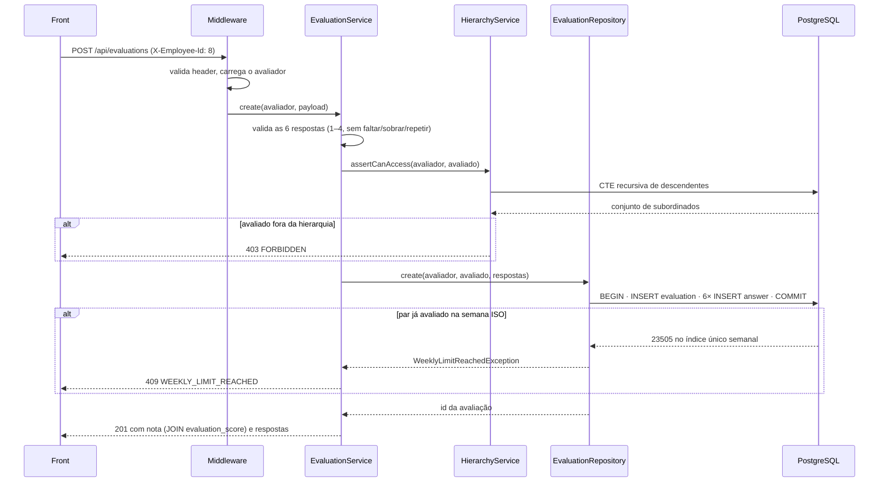
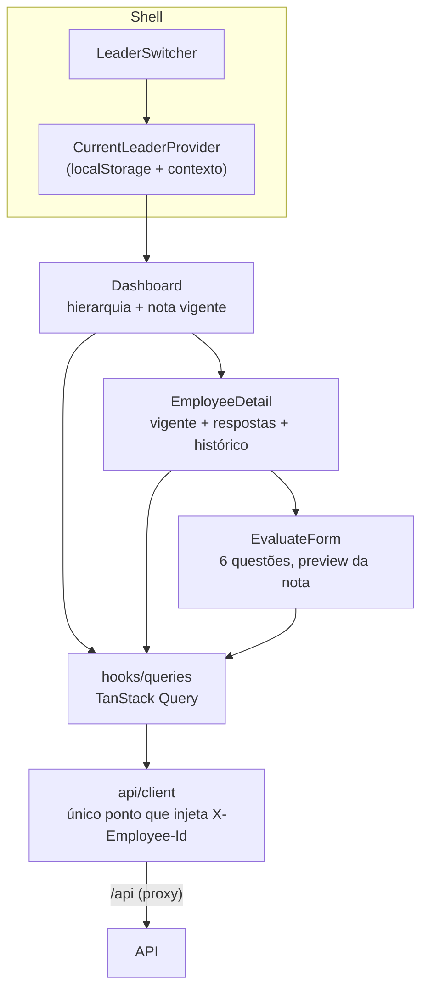

# Arquitetura

## Visão geral (Docker Compose)

Três serviços na mesma rede; um único `docker compose up --build` sobe tudo.

- O nginx serve o build do React e faz proxy de `/api` para o container `api` — o front só usa
  caminhos relativos e **não existe CORS** para configurar.
- O Postgres executa as migrations de `api/migrations/` na primeira subida (volume vazio) e
  provisiona também o banco `evaluation_test`, usado exclusivamente pela suíte de testes.
- Healthchecks encadeados: `web` só sobe com a `api` saudável, que só sobe com o `db` saudável —
  e o healthcheck do banco usa TCP para não reportar pronto durante o initdb.

## Fluxo de uma requisição na API

| Camada | Responsabilidade | Não faz |
|---|---|---|
| `Middleware` | Resolve o líder atual do header `X-Employee-Id` | — |
| `Controller` | Lê a request, delega, serializa | Regra de negócio, SQL |
| `Service` | Hierarquia, visibilidade, limite semanal, validação | SQL |
| `Repository` | Único ponto que toca PDO; toda query parametrizada | Decisão de negócio |

O middleware é aplicado **por rota**: o catálogo (`/employees`, `/questions`) fica público para
alimentar o seletor de líder antes de haver líder escolhido.

## Sequência da regra mais rica: criar uma avaliação

Dois pontos deliberados nessa sequência:

1. **A trava semanal é decidida pelo banco**, não por um `SELECT` antes do `INSERT` — duas
   requisições simultâneas do mesmo par são serializadas pelo índice único, e a segunda vira
   409. Não há janela de corrida.
2. **Validação antes da autorização**: a CTE recursiva é a consulta mais cara do sistema e não
   é executada para payloads que já nasceram inválidos.

## Frontend

- O header `X-Employee-Id` é injetado em **um único lugar** (`api/client.ts`); nas rotas
  autenticadas a identidade é parâmetro obrigatório do tipo — esquecê-la é erro de compilação.
- O formulário de avaliação é *keyed* por `(líder, avaliado)`: trocar qualquer um dos dois
  remonta o formulário, e uma avaliação nunca é submetida em nome de um líder que não a
  preencheu.
- Erros da API chegam normalizados (`ApiError` com `status`/`code`); 409 e 403 têm tratamento
  visual próprio.

## Onde entraria autenticação real

O `CurrentEmployeeMiddleware` (backend) e o `CurrentLeaderProvider` + `api/client.ts` (front)
são os únicos pontos que conhecem a origem da identidade. Um auth real (sessão, JWT) substitui
o header confiado por credencial verificada **nesses dois pontos**; services, repositories,
regras de visibilidade e telas não mudam uma linha.
