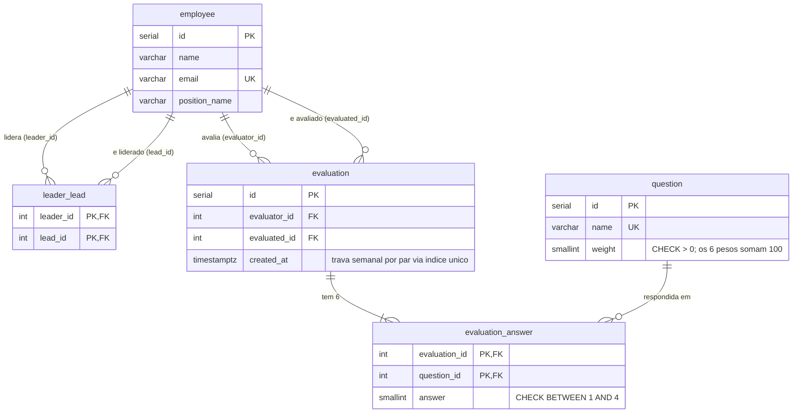

# Modelo de dados

`employee` e `leader_lead` vêm do dump fornecido, sem alteração. As demais estruturas foram
criadas para o case.



## Pontos que não aparecem no diagrama

**`leader_lead` é um grafo N:N, não uma árvore.** Nada no schema impede múltiplos líderes por
funcionário nem ciclos. As CTEs recursivas usam `UNION` (deduplica) e limite de profundidade;
a autorização não assume "ninguém é descendente de si mesmo".

**A trava semanal vive num índice, não numa coluna:**

```sql
CREATE UNIQUE INDEX uq_evaluation_pair_week
    ON evaluation (evaluator_id, evaluated_id, (date_trunc('week', created_at AT TIME ZONE 'UTC')));
```

Semana ISO (segunda a domingo), em UTC. O `AT TIME ZONE` torna a expressão `IMMUTABLE`, condição
do Postgres para indexá-la — e de quebra fixa a semântica da semana independente do fuso do
servidor.

**FKs de avaliação são `ON DELETE RESTRICT`.** Remover um funcionário não pode apagar histórico:
a imutabilidade das respostas é requisito do case.

## Views (a regra de negócio que mora no banco)

| View | O que resolve |
|---|---|
| `evaluation_score` | Nota ponderada: `ROUND(Σ(answer × weight) / Σ(weight), 2)`. Divisor é o peso total do questionário — avaliação incompleta sai com nota baixa, nunca inflada. |
| `employee_depth` | Profundidade de cada funcionário a partir da raiz (o CEO), via CTE recursiva. |
| `current_evaluation` | A avaliação **vigente** de cada funcionário: semana ISO mais recente → menor profundidade do avaliador → mais recente → maior id. |

As views existem para que cada regra tenha **um único dono**: a lista de subordinados e a tela
de detalhe leem `current_evaluation` e por construção não podem discordar sobre qual avaliação
vale.
